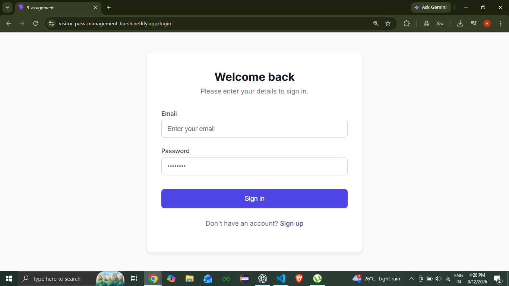
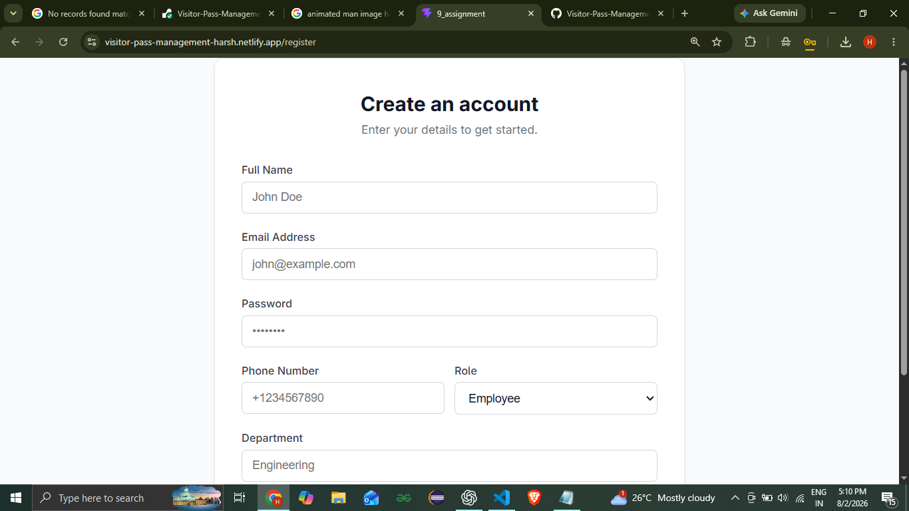
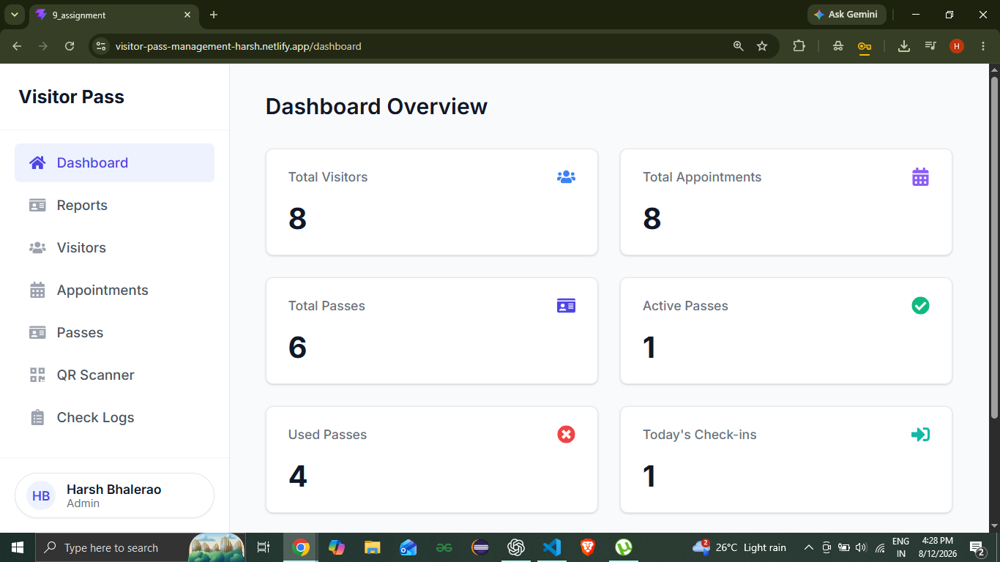
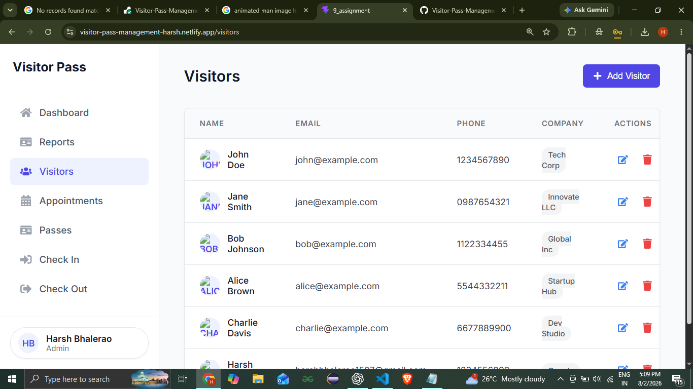
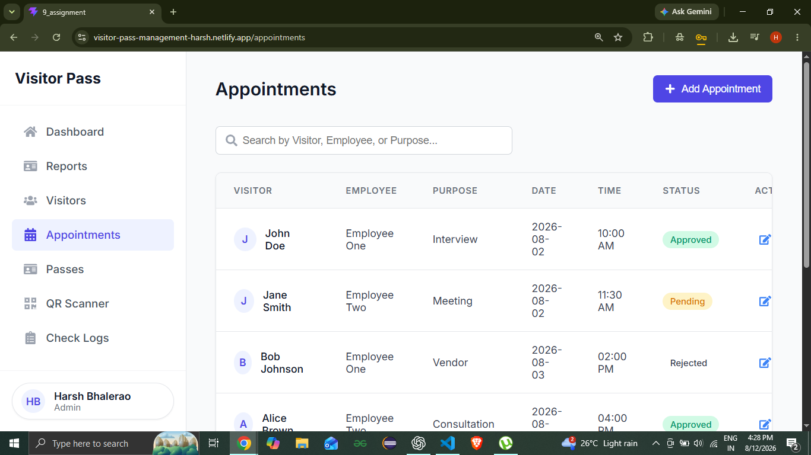
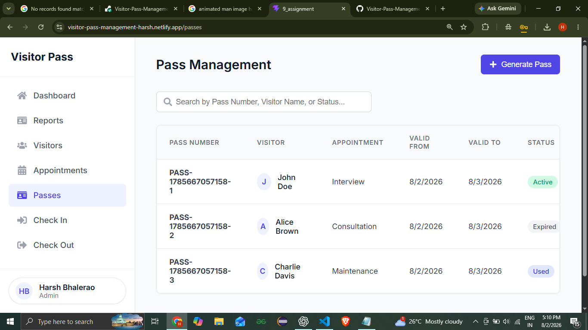
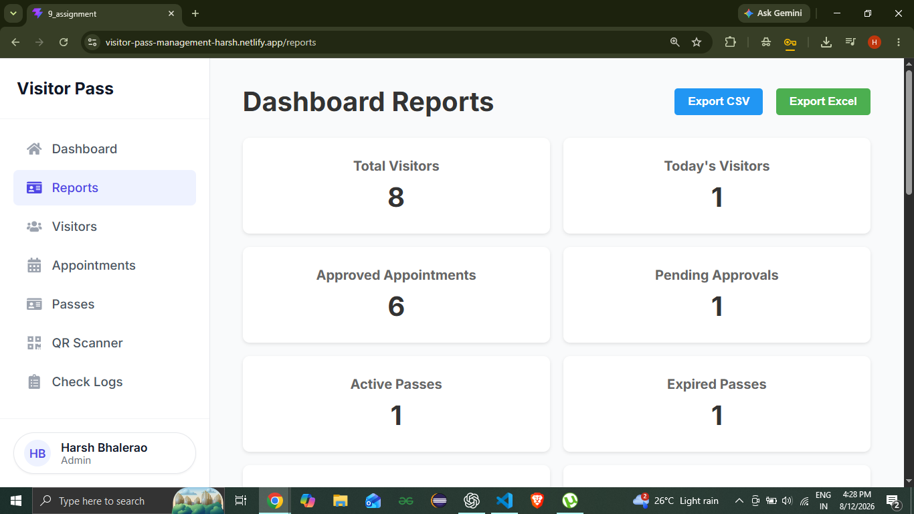

# 🚪 Visitor Pass Management System

A full-stack **Visitor Pass Management System** built using the **MERN Stack (MongoDB, Express.js, React.js, Node.js)**.

The system digitizes visitor management by allowing organizations to register visitors, schedule appointments, issue QR-code based visitor passes, verify check-ins/check-outs, and manage visitor records securely.

---

# ✨ Features

## 🔐 Authentication & Authorization

- JWT Authentication
- Role-Based Access Control
- Secure Login & Registration
- Protected Routes

---

## 👥 User Roles

- Admin
- Security / Front Desk
- Employee / Host

---

## 👤 Visitor Management

- Add Visitor
- Update Visitor
- Delete Visitor
- Search Visitors
- Upload Visitor Photo
- View Visitor Details

---

## 📅 Appointment Management

- Create Appointment
- Approve / Reject Appointment
- Employee Assignment
- Appointment Status Tracking

---

## 🎫 Pass Management

- Generate Digital Visitor Pass
- QR Code Generation
- PDF Pass Generation

---

## 🚪 Check-In / Check-Out

- Visitor Check-In
- Visitor Check-Out
- Check Logs

---

## 📊 Dashboard & Reports

- Dashboard Statistics
- Charts
- Search
- Advanced Filters
- CSV Export
- Excel Export

---

## 📧 Notifications

- Email Notifications using Brevo API

---

## ✅ Validation

- Backend Input Validation
- Environment Variable Validation

---

## 🌱 Demo Data

- MongoDB Seed Script

---

# 🛠 Tech Stack

### Frontend

- React.js
- React Router
- Axios
- CSS

### Backend

- Node.js
- Express.js
- JWT
- Multer
- Bcrypt
- QRCode
- PDFKit
- Brevo Email API

### Database

- MongoDB
- Mongoose

---

# 📁 Folder Structure

```
9_assignment
│
├── client
├── server
├── screenshots
└── README.md
```

---

# ⚙ Installation

## Clone Repository

```bash
git clone https://github.com/harshbhalerao1507-coder/Visitor-Pass-Management-System.git
```

---

## Install Dependencies

### Backend

```bash
cd server
npm install
```

### Frontend

```bash
cd client
npm install
```

---

# 🔑 Environment Variables

Create a `.env` file inside the **server** folder.

```env
PORT=5000

MONGO_URI=<Your MongoDB URI>

SECRET=<Your JWT Secret>

BREVO_API_KEY=<Your Brevo API Key>

SENDER_EMAIL=<Your Verified Email>
```

---

# ▶ Running the Project

### Backend

```bash
cd server
npm run dev
```

### Frontend

```bash
cd client
npm run dev
```

---

# 🌱 Seed Demo Data

```bash
cd server
npm run seed
```

The script automatically creates demo users, visitors, appointments, passes, and check logs.

---

# 📸 Screenshots

## Login Page



---

## Register Page



---

## Dashboard



---

## Visitors



---

## Appointments



---

## Pass Management



---

## Reports



---

# 🎥 Demo Video

https://youtu.be/WDcjWJ3BXPw

---

# 🌐 Deployment

## Frontend

https://visitor-pass-management-harsh.netlify.app

## Backend

https://visitor-pass-management-system-52nv.onrender.com

---

# 👤 Demo Credentials

## Admin

Email

```
admin@demo.com
```

Password

```
Admin@123
```

---

## Security

Email

```
security@demo.com
```

Password

```
Security@123
```

---

## Employee

Email

```
employee1@demo.com
```

Password

```
Employee@123
```

---

# 📦 API Modules

- Authentication
- Users
- Visitors
- Appointments
- Passes
- Reports
- Dashboard
- Check Logs

---

# 🚀 Future Enhancements

- OTP Verification
- SMS Notifications
- Multi-Organization Support
- Docker Deployment
- Advanced Analytics

---

# 👨‍💻 Author

**Harsh Bhalerao**

Third Year Computer Engineering Student

GitHub

https://github.com/harshbhalerao1507-coder
